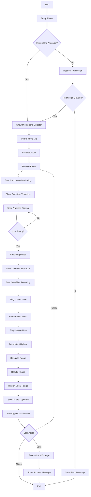
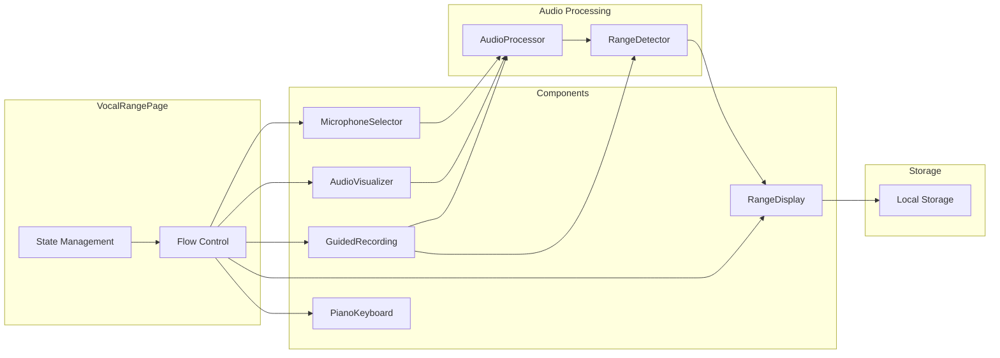
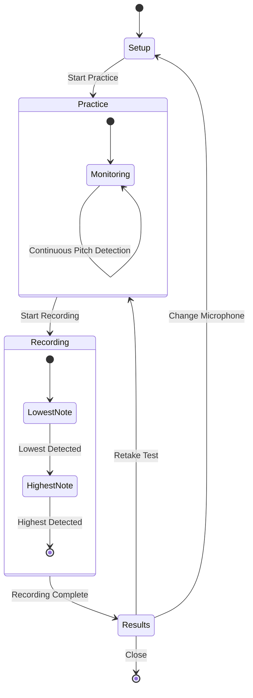
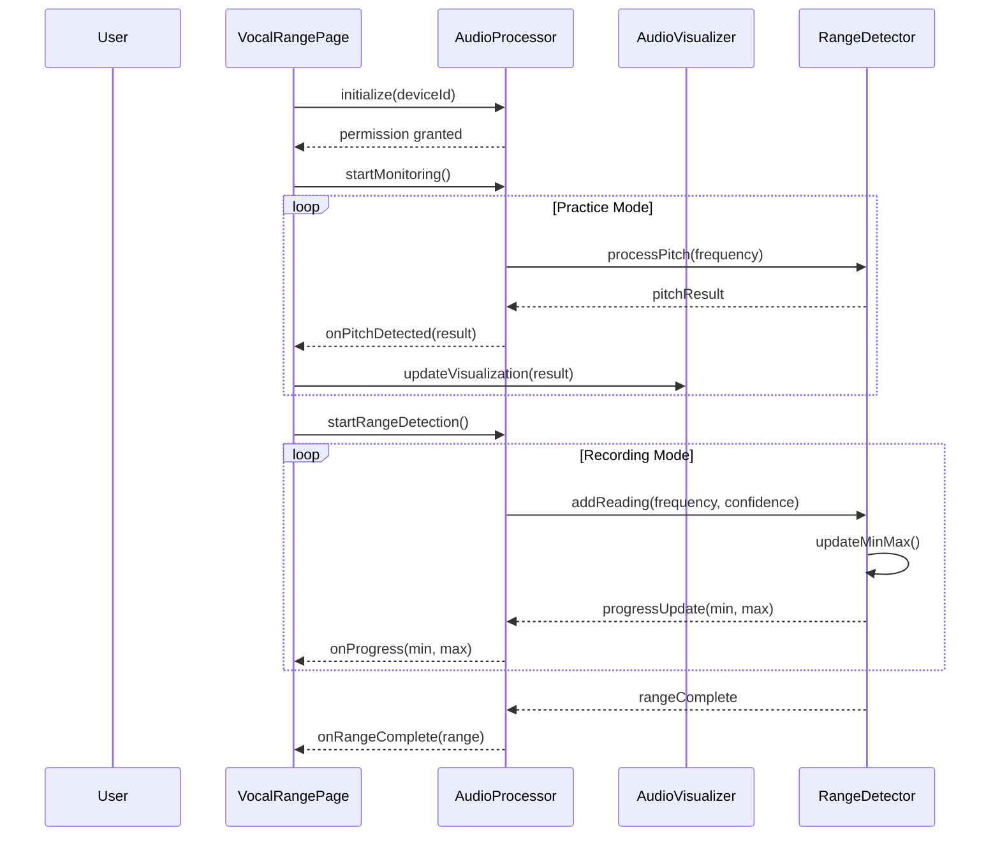
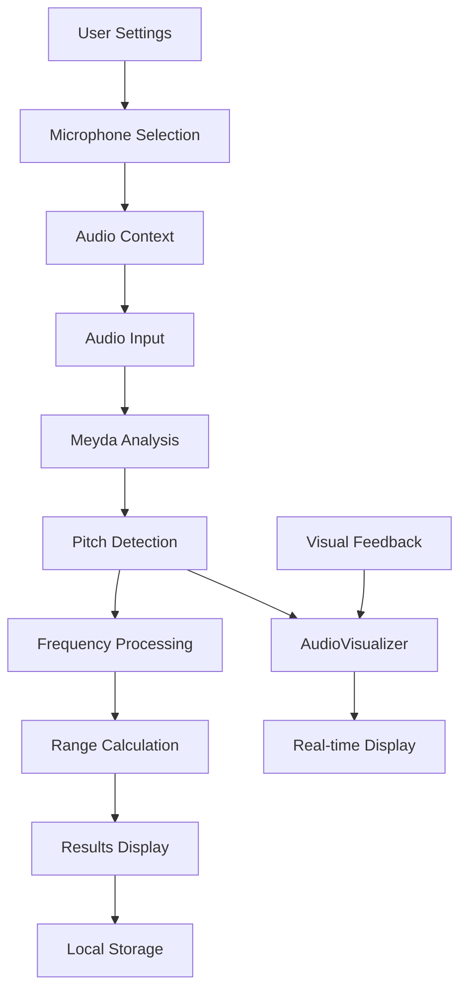
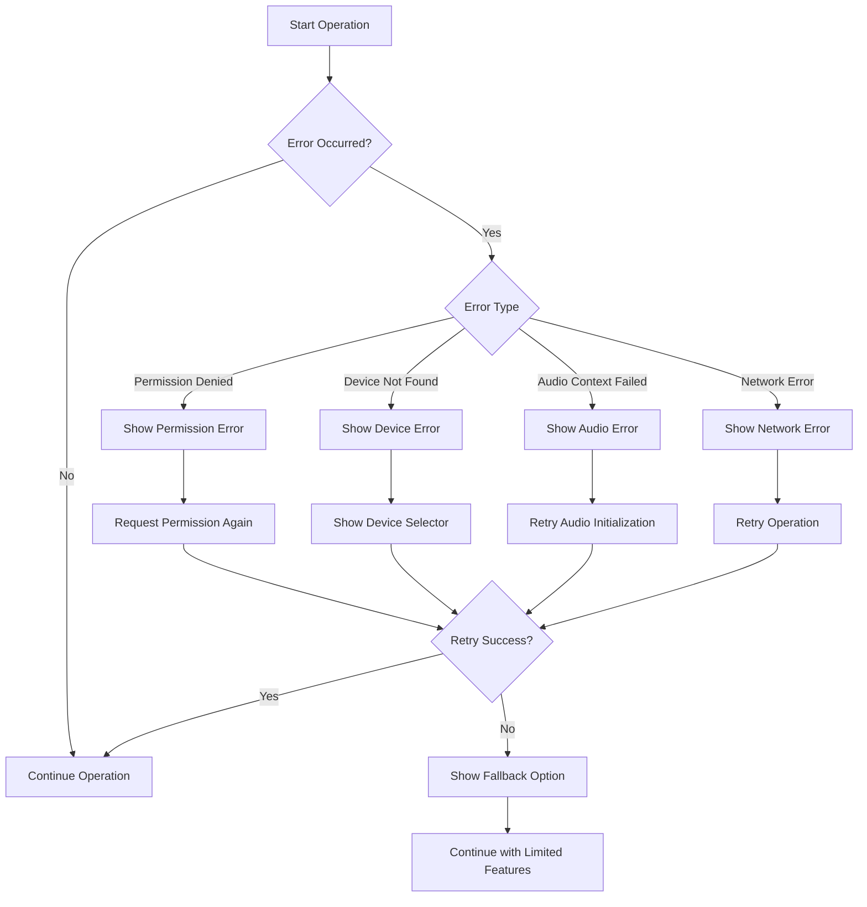

# Vocal Range Detection - Flow Diagram Baru

## Current Flow vs New Flow Comparison

### Current Flow (6 Steps)
```
┌─────────┐    ┌─────────────┐    ┌──────────┐    ┌──────────┐    ┌───────────┐    ┌──────────┐
│   Idle  │───▶│ Permission  │───▶│ Lowest   │───▶│ Highest  │───▶│Processing │───▶│ Complete │
└─────────┘    └─────────────┘    └──────────┘    └──────────┘    └───────────┘    └──────────┘
```

### New Flow (4 Steps)
```
┌────────┐    ┌──────────┐    ┌──────────┐    ┌─────────┐
│ Setup  │───▶│ Practice │───▶│ Record   │───▶│ Results │
└────────┘    └──────────┘    └──────────┘    └─────────┘
```

## Detailed Flow Diagram



## Component Interaction Diagram



## State Transition Diagram



## User Experience Flow

### Setup Phase
1. User membuka halaman
2. Sistem menampilkan daftar microphone yang tersedia
3. User memilih microphone
4. Sistem meminta permission jika belum diberikan
5. Audio context diinisialisasi

### Practice Phase
1. Visualizer aktif secara kontinyu
2. User bisa bernyanyi untuk melihat pitch real-time
3. Tidak ada data yang disimpan
4. User bisa berlatih sebanyak yang diinginkan
5. Tombol "Start Recording" untuk melanjutkan

### Recording Phase
1. Sistem menampilkan instruksi panduan
2. User diminta menyanyikan nada terendah
3. Sistem auto-detect ketika nada stabil
4. User diminta menyanyikan nada tertinggi
5. Sistem auto-detect ketika nada stabil
6. Sistem menghitung range vokal

### Results Phase
1. Tampilkan nada terendah dan tertinggi
2. Tampilkan piano keyboard dengan highlighted range
3. Tampilkan voice type classification
4. Opsi untuk menyimpan hasil
5. Opsi untuk mengulang test

## Technical Implementation Flow

### Audio Processing Flow


### Data Flow


## Error Handling Flow



## Performance Optimization Flow

```mermaid
graph LR
    A[Audio Stream] --> B[Buffer Management]
    B --> C[Pitch Detection]
    C --> D[Confidence Filtering]
    D --> E[Range Tracking]
    E --> F[UI Updates]
    
    G[Performance Monitor] --> H{CPU Usage > 80%?}
    H -->|Yes| I[Reduce Update Rate]
    H -->|No| J[Maintain 60fps]
    
    I --> K[Update Every 100ms]
    J --> L[Update Every 50ms]
    
    K --> F
    L --> F