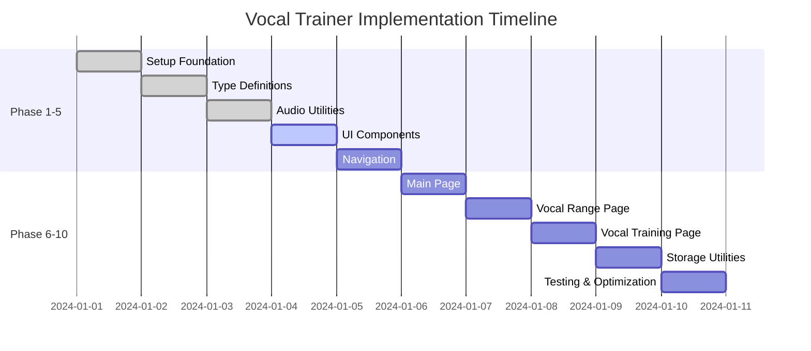

# Vocal Trainer Phase-Oriented Implementation Plan

## Overview
Plan ini memecah implementasi Vocal Trainer menjadi 10 phase yang dapat diselesaikan dalam 1 hari per phase. Setiap phase memiliki deliverables yang jelas dan dapat diuji secara independen.

## Phase 1: Setup Foundation & Dependencies (1 hari) ✅ COMPLETED

### Tujuan
Menyiapkan project structure dan dependencies yang diperlukan untuk aplikasi Vocal Trainer.

### Tasks
1. Install additional dependencies:
   - `meyda` untuk audio analysis
   - Library UI tambahan jika needed

2. Update package.json dengan dependencies baru

3. Buat struktur folder sesuai implementation plan:
   ```
   src/
   ├── components/
   ├── types/
   ├── lib/
   └── app/
       ├── vocal-range/
       └── vocal-training/
   ```

### Deliverables
- Project structure yang lengkap
- Dependencies yang terinstall
- Build yang berhasil tanpa error

### Testing
- `npm run build` berhasil
- `npm run dev` berjalan normal
- Tidak ada missing dependencies

---

## Phase 2: Create Type Definitions (1 hari) ✅ COMPLETED

### Tujuan
Membuat semua type definitions yang diperlukan untuk aplikasi.

### Tasks
1. Buat file `src/types/audio.ts` dengan interface:
   - `PitchData`
   - `VocalRange`
   - `AudioSettings`
   - `PitchDetectionResult`

2. Buat file `src/types/training.ts` dengan interface:
   - `TrainingSession`
   - `TrainingScore`
   - `TrainingVariation`
   - `TrainingMode` enum

### Deliverables
- `src/types/audio.ts`
- `src/types/training.ts`
- Type definitions yang lengkap dan konsisten

### Testing
- TypeScript compilation berhasil
- Tidak ada type errors
- Types dapat di-import dengan benar

---

## Phase 3: Implement Audio Utilities (1 hari) ✅ COMPLETED

### Tujuan
Membuat core audio processing functionality untuk pitch detection.

### Tasks
1. Buat `src/lib/audio.ts` dengan class `AudioProcessor`:
   - Microphone access
   - Audio context setup
   - Real-time audio processing

2. Buat `src/lib/pitch.ts` dengan fungsi:
   - `frequencyToNote()`
   - `noteToFrequency()`
   - `isPitchInTolerance()`
   - `calculateVocalRange()`
   - Note frequency mappings

### Deliverables
- `src/lib/audio.ts`
- `src/lib/pitch.ts`
- Audio processing yang functional

### Testing
- Microphone access berhasil
- Pitch detection bekerja
- Frequency to note conversion akurat

---

## Phase 4: Create Basic UI Components (1 hari)

### Tujuan
Membuat reusable UI components untuk aplikasi.

### Tasks
1. Buat `src/components/AudioVisualizer.tsx`:
   - Canvas-based waveform visualization
   - Real-time pitch indicator
   - Target note highlighting

2. Buat `src/components/PianoKeyboard.tsx`:
   - Interactive piano keyboard
   - Multiple octave support
   - Note highlighting

3. Buat `src/components/PitchMeter.tsx`:
   - Visual pitch accuracy indicator
   - Real-time feedback

4. Buat `src/components/ProgressIndicator.tsx`:
   - Training progress visualization
   - Step indicators

### Deliverables
- Semua UI components
- Components yang responsive
- Smooth animations

### Testing
- Components render dengan benar
- Interactive elements berfungsi
- Responsive design

---

## Phase 5: Implement Navigation Component (1 hari)

### Tujuan
Membuat navigation system untuk aplikasi.

### Tasks
1. Buat `src/components/Navigation.tsx`:
   - Active route highlighting
   - Responsive design
   - Smooth transitions

2. Update `src/app/layout.tsx`:
   - Include navigation component
   - Update metadata untuk Vocal Trainer
   - Add proper styling

### Deliverables
- `src/components/Navigation.tsx`
- Updated `src/app/layout.tsx`
- Consistent navigation across pages

### Testing
- Navigation berfungsi dengan benar
- Active states terlihat jelas
- Mobile responsive

---

## Phase 6: Update Main Page (1 hari)

### Tujuan
Membuat landing page yang menarik dan informatif.

### Tasks
1. Update `src/app/page.tsx`:
   - Hero section dengan app description
   - Feature cards untuk Vocal Range & Training
   - Call-to-action buttons
   - Responsive grid layout

2. Add proper styling dan animations

### Deliverables
- Updated `src/app/page.tsx`
- Professional landing page
- Clear navigation ke features

### Testing
- Page loads tanpa error
- All links berfungsi
- Responsive design
- Smooth animations

---

## Phase 7: Create Vocal Range Detection Page (1 hari)

### Tujuan
Membuat halaman untuk deteksi range vokal pengguna.

### Tasks
1. Buat `src/app/vocal-range/page.tsx`:
   - Step-by-step detection process
   - Real-time pitch display
   - Audio visualizer integration
   - Range calculation dan display

2. Implement state management untuk:
   - Recording states
   - Pitch data
   - Detection steps
   - Results

### Deliverables
- `src/app/vocal-range/page.tsx`
- Functional vocal range detection
- User-friendly interface

### Testing
- Microphone access berfungsi
- Pitch detection akurat
- Range calculation benar
- User flow intuitive

---

## Phase 8: Create Vocal Training Page (1 hari)

### Tujuan
Membuat halaman latihan vokal dengan berbagai variasi.

### Tasks
1. Buat `src/app/vocal-training/page.tsx`:
   - Training setup (root note, variation selection)
   - Real-time pitch feedback
   - Score tracking
   - Progress visualization

2. Implement training logic:
   - Note sequence generation
   - Accuracy calculation
   - Score tracking
   - Session management

### Deliverables
- `src/app/vocal-training/page.tsx`
- Complete training functionality
- Multiple training variations

### Testing
- Training flow berfungsi
- Pitch accuracy detection
- Score calculation benar
- All variations work

---

## Phase 9: Implement Storage Utilities (1 hari)

### Tujuan
Membuat local storage system untuk data persistence.

### Tasks
1. Buat `src/lib/storage.ts`:
   - `saveVocalRange()` dan `loadVocalRange()`
   - `saveTrainingSession()` dan `loadTrainingSessions()`
   - Settings management
   - Data cleanup utilities

2. Integrate storage dengan:
   - Vocal range detection
   - Training sessions
   - User preferences

### Deliverables
- `src/lib/storage.ts`
- Data persistence functionality
- Settings management

### Testing
- Data survives page refresh
- Storage quota handling
- Error handling untuk storage failures
- Data integrity maintained

---

## Phase 10: Testing & Optimization (1 hari)

### Tujuan
Final testing, optimization, dan preparation untuk production.

### Tasks
1. Comprehensive testing:
   - Cross-browser compatibility
   - Mobile responsiveness
   - Performance optimization
   - Error handling

2. Code optimization:
   - Bundle size optimization
   - Memory leak prevention
   - Audio resource cleanup
   - Performance profiling

3. Production preparation:
   - Environment variables
   - Build optimization
   - Security considerations
   - Documentation updates

### Deliverables
- Optimized production build
- Comprehensive test coverage
- Performance benchmarks
- Production deployment guide

### Testing
- Production build successful
- All features work in production
- Performance metrics met
- No memory leaks or errors

---

## Implementation Timeline



## Success Criteria

### Technical Requirements
- [x] Build successful tanpa errors
- [x] All TypeScript types properly defined
- [x] Audio processing works consistently
- [ ] Responsive design on all devices
- [ ] Data persistence functional

### User Experience Requirements
- [ ] Intuitive navigation
- [ ] Clear feedback for all actions
- [ ] Smooth animations and transitions
- [ ] Accessible design patterns
- [ ] Error handling with user-friendly messages

### Performance Requirements
- [ ] Page load time < 3 seconds
- [ ] Real-time pitch detection latency < 100ms
- [ ] Memory usage stable during extended use
- [ ] No audio glitches or dropouts

## Risk Mitigation

### Technical Risks
1. **Microphone Access Issues**
   - Mitigation: Proper HTTPS setup, clear permission requests
   - Fallback: Alternative input methods

2. **Browser Compatibility**
   - Mitigation: Progressive enhancement, feature detection
   - Fallback: Graceful degradation for older browsers

3. **Performance Issues**
   - Mitigation: Code splitting, lazy loading, optimization
   - Monitoring: Performance metrics and profiling

### User Experience Risks
1. **Complex Audio Setup**
   - Mitigation: Clear instructions, visual feedback
   - Testing: User testing with various devices

2. **Pitch Detection Accuracy**
   - Mitigation: Tuning parameters, user calibration
   - Testing: Multiple voice types and environments

## Next Steps

Setelah completion dari semua 10 phases:
1. User acceptance testing
2. Beta release with feedback collection
3. Feature enhancements based on user feedback
4. Production deployment
5. Ongoing maintenance and updates

---

*Plan ini dirancang untuk fleksibel dan dapat disesuaikan berdasarkan progress dan challenges yang ditemukan selama implementation.*